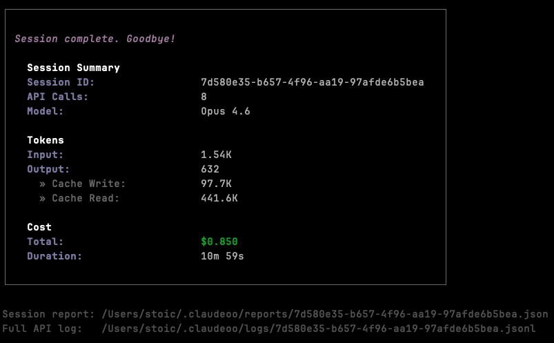

<div align="center">
  <div align="center">
    
  </div>

  <p>
    Accurate token usage & cost tracker for
    <a href="https://docs.anthropic.com/en/docs/claude-code">Claude Code</a>.<br>
    Claude Code's built-in tracking undercounts output tokens by ~2x —
    <b>claudeoo</b> captures the real numbers.
  </p>

  <p>
    <a href="#why-claudeoo">Why?</a> •
    <a href="#features">Features</a> •
    <a href="#installation">Installation</a> •
    <a href="#usage">Usage</a> •
    <a href="#how-it-works">How It Works</a> •
    <a href="#query-commands">Query Commands</a>
  </p>

  <p>
    
    
    
    <a href="https://www.npmjs.com/package/claudeoo">
      
    </a>
    <a href="http://makeapullrequest.com">
      
    </a>
  </p>
</div>

---

## Why claudeoo?

Claude Code logs API calls to JSONL transcripts, but these logs capture usage snapshots **mid-stream** — before the final `message_delta` event arrives. This means:

- **Output tokens are undercounted** by roughly 2x
- **`stop_reason` is always `null`** in the logs (never captured)
- **Cache tokens may be incomplete**

claudeoo intercepts the full SSE stream end-to-end and captures the authoritative final usage numbers — so you know exactly what you're spending.

---

## Features

- **Accurate token counts** — captures final usage from completed SSE streams, not mid-stream snapshots
- **Real-time cost tracking** — live cost updates in your terminal tab title as tokens stream
- **Per-turn breakdowns** — input, output, cache read/write tokens for every API call
- **Content type tracking** — thinking, text, and tool_use character counts
- **Session reports** — detailed JSON reports saved automatically after each session
- **Full API logs** — raw request/response logging for debugging
- **Auto-updated pricing** — fetches latest model pricing from Anthropic's docs on every startup
- **SQLite + JSONL storage** — queryable database with JSONL backup
- **CLI queries** — stats, sessions, export commands to analyze your usage
- **Zero runtime dependencies** — uses Node.js built-in `node:sqlite`

---

## Installation

```bash
npm install -g claudeoo
```

**Requirements:**

| Requirement | Version |
|-------------|---------|
| Node.js | >= 22.5.0 (for built-in `node:sqlite`) |
| Claude Code | npm-installed: `npm install -g @anthropic-ai/claude-code` |

### From source

```bash
git clone https://github.com/stoic/claudeoo.git
cd claudeoo
npm install
npm run build
npm link
```

---

## Usage

Use `claudeoo` exactly like you use `claude` — all arguments are passed through:

```bash
# Interactive session
claudeoo

# Single prompt
claudeoo -p "explain this code"

# With Claude flags
claudeoo --dangerously-skip-permissions --model sonnet

# With verbose tracking
claudeoo --coo-verbose -p "hello"
```

### Live Tracking

Your terminal tab title updates in real-time during streaming:

```
[claudeoo] 💰 $0.47 | ↑125K ↓3.2K | turn 5 | ⏳
```

### Session Summary

After each session ends, you get a clean summary with token counts, cost, and file paths:

<div align="center">
  
</div>

---

## Query Commands

```bash
# Today's usage stats
claudeoo stats --today

# This week / all time
claudeoo stats --week
claudeoo stats --all

# List recent sessions
claudeoo sessions --limit 10

# Per-turn breakdown for a session
claudeoo session <session-id>

# Export all data
claudeoo export --format csv --output usage.csv
claudeoo export --format json

# Show current pricing
claudeoo pricing --show
```

---

## How It Works

claudeoo finds your npm-installed Claude Code (`cli.js`) and launches it with a `node --require` preload that wraps `globalThis.fetch()`. It observes the Anthropic API's SSE stream without modifying it — Claude works exactly as normal.

```
claudeoo [args...]
  → node --require interceptor-loader.js <claude-cli.js> ...args
  → interceptor wraps globalThis.fetch()
  → filters /v1/messages calls
  → observes SSE stream via Symbol.asyncIterator monkey-patch
  → captures message_start (input tokens) + message_delta (output tokens)
  → writes to ~/.claudeoo/usage.db + JSONL + session reports
  → updates terminal title with live cost
```

### What Gets Tracked

Each API call records:

| Field | Description |
|-------|-------------|
| Input tokens | Prompt tokens sent to the API |
| Output tokens | Completion tokens (accurate, from final event) |
| Cache creation | Tokens written to prompt cache |
| Cache read | Tokens read from prompt cache |
| Thinking chars | Characters in thinking/reasoning blocks |
| Text chars | Characters in text response blocks |
| Tool use chars | Characters in tool_use blocks |
| Model | Model ID used for the call |
| Cost | Calculated cost in USD |
| Duration | Wall-clock time per API call |
| Stop reason | Why the model stopped (end_turn, tool_use, etc.) |

---

## Flags

| Flag | Description |
|------|-------------|
| `--coo-verbose` | Real-time per-call logging to stderr |
| `--coo-no-db` | Skip SQLite, write JSONL only |

These flags are consumed by claudeoo and **not** passed to Claude.

---

## Data Storage

All data is stored in `~/.claudeoo/`:

```
~/.claudeoo/
├── usage.db                    # SQLite database (queryable)
├── pricing.json                # Auto-updated model pricing
├── sessions/
│   └── <session-id>.jsonl      # Per-call JSONL records
├── reports/
│   └── <session-id>.json       # Detailed session report (JSON)
└── logs/
    └── <session-id>.jsonl      # Full API request/response log
```

---

## Pricing

Pricing is auto-fetched from [Anthropic's pricing page](https://docs.anthropic.com/en/docs/about-claude/pricing) on every startup (5s timeout, falls back to cached). Supports all current Claude models including Opus, Sonnet, and Haiku variants with cache pricing.

```bash
claudeoo pricing --show
```

| Model | Input | Output | Cache Write | Cache Read |
|-------|-------|--------|-------------|------------|
| Claude Opus 4.6 | $5.00 | $25.00 | $6.25 | $0.50 |
| Claude Sonnet 4.6 | $3.00 | $15.00 | $3.75 | $0.30 |
| Claude Haiku 4.5 | $1.00 | $5.00 | $1.25 | $0.10 |

*Per million tokens. Full pricing in `pricing.json`.*

---

## Project Structure

```
claudeoo/
├── package.json                # npm package config
├── tsconfig.json               # TypeScript config
└── src/
    ├── cli.ts                  # Entry point — argument parsing, command routing
    ├── run.ts                  # Find Claude cli.js, spawn with interception
    ├── interceptor-loader.js   # CommonJS preload (must stay .js)
    ├── interceptor.ts          # fetch() wrapper, SSE parser, content block tracker
    ├── recorder.ts             # Write records to JSONL + SQLite + full logs
    ├── db.ts                   # SQLite schema, queries for stats/sessions/export
    ├── pricing.ts              # Model pricing resolver (fuzzy match model IDs)
    ├── pricing.json            # Shipped default pricing data
    ├── update-pricing.ts       # Auto-fetch latest pricing from Anthropic docs
    ├── types.ts                # All TypeScript interfaces
    ├── format.ts               # Terminal colors, table formatting, session summary
    ├── stats.ts                # claudeoo stats command
    ├── sessions.ts             # claudeoo sessions / session <id> commands
    └── export.ts               # claudeoo export command (CSV/JSON)
```

---

## Acknowledgements

Inspired by [cccost](https://github.com/badlogic/cccost/tree/main) by Mario Zechner — the original `fetch()` interception approach for tracking Claude Code costs. claudeoo builds on that idea with auto-updated pricing, SQLite storage, per-turn granularity, content type tracking, and a query CLI.

---

## License

MIT

---

<div align="center">
  <sub>Built for knowing exactly what Claude Code costs you.</sub>
</div>
